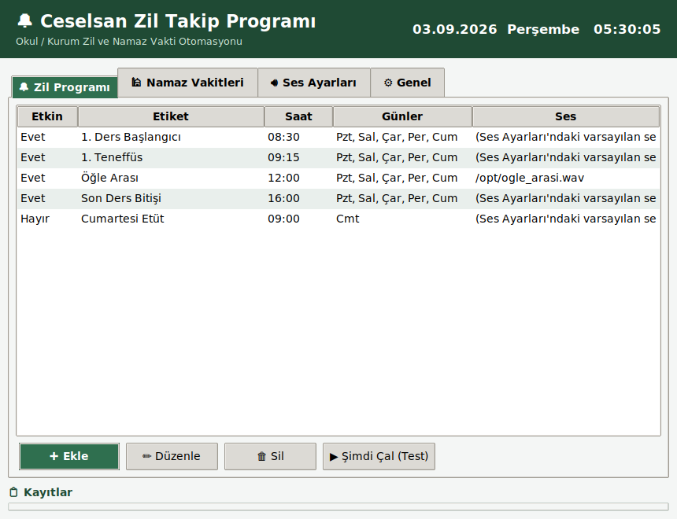
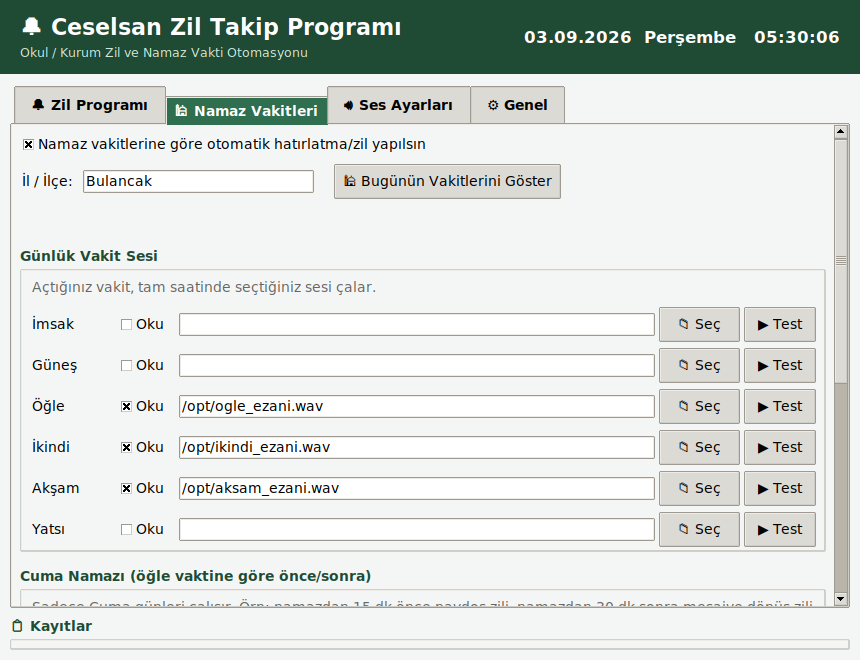
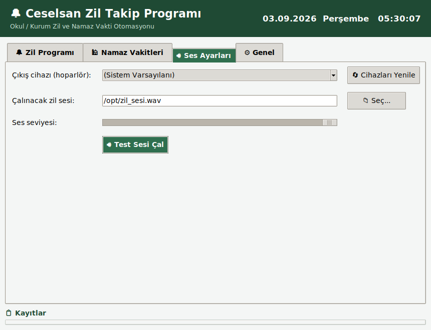
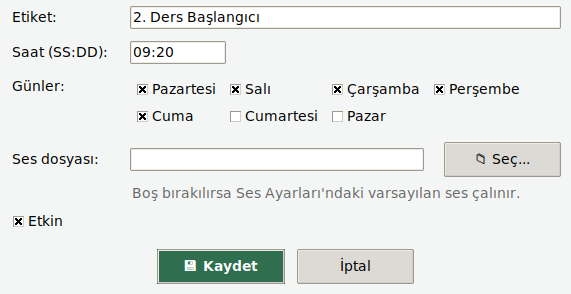
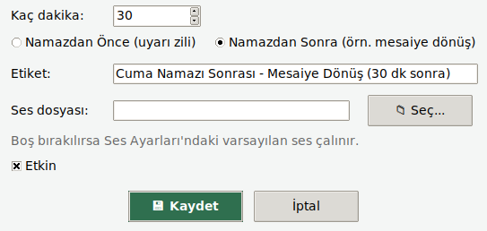
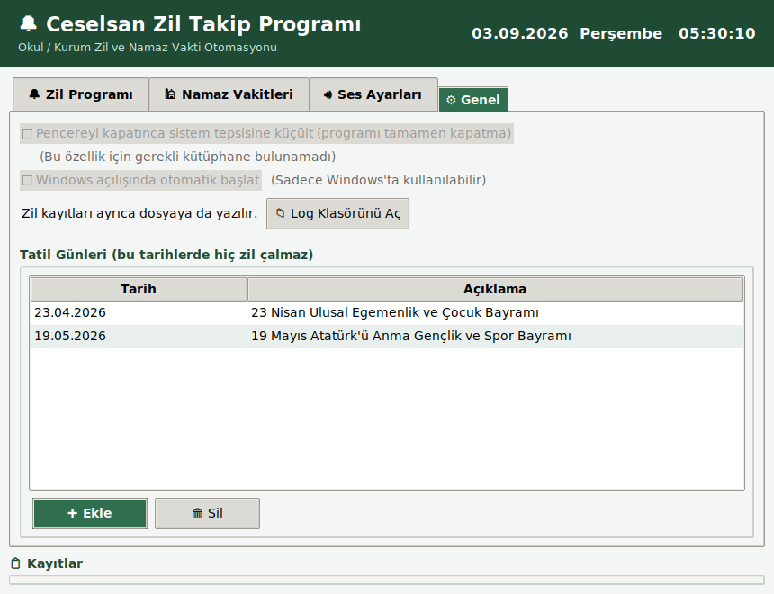

# 🔔 Ceselsan Zil Takip Programı

Okul/kurum zil saatlerini otomatik olarak çalan, Windows için masaüstü
uygulaması. Kaynak kodu `zil_takip/` klasöründedir, Python + Tkinter ile
yazılmıştır.

## 📥 İndir

Kuruluma gerek yok, GitHub hesabı da gerekmiyor — aşağıdaki linke
tıklamanız yeterli:

**👉 [CeselsanZilTakip.exe indir](https://github.com/Canerakcy/Zil-Takip-Programi/releases/latest/download/CeselsanZilTakip.exe)**

### ⚠️ "Windows bu uygulamayı tanımıyor" uyarısı çıkarsa

Bu, **virüs ya da zararlı yazılım olduğu anlamına gelmez.** Windows
SmartScreen, ücretli bir "kod imzalama sertifikası" ile imzalanmamış her
küçük/bağımsız uygulama için bu uyarıyı gösterir - ücretsiz/açık kaynak
projelerde çok yaygındır. Devam etmek için:

1. Uyarı penceresinde **"Daha fazla bilgi"** (More info) yazısına tıklayın.
2. Açılan **"Yine de çalıştır"** (Run anyway) butonuna basın.

(Bu proje açık kaynaktır, kaynak kodun tamamı bu depoda - isterseniz
`zil_takip/` klasöründeki kodu inceleyip kendiniz de derleyebilirsiniz;
bkz. aşağıdaki "Kendi bilgisayarınızda elle derlemek" bölümü.)

## Ekran Görüntüleri

| Zil Programı | Cuma Namazı |
|---|---|
|  |  |

| Ses Ayarları | Yeni Zil Ekleme |
|---|---|
|  |  |

**Namazdan önce/sonra zil ekleme** (her kurumun mola/mesai süresi
farklı olduğu için tamamen size bağlı):



**Genel Ayarlar** (sistem tepsisi, Windows'ta otomatik başlatma, tatil günleri):



## Özellikler

- **Haftalık zil programı**: İstediğiniz saatlerde, istediğiniz günlerde
  otomatik zil çalar (ders başlangıç/bitiş saatleri, teneffüs vb.).
- **Hoparlör seçimi**: Sesin hangi ses çıkış cihazından (hoparlör,
  kulaklık, harici ses kartı vb.) çalınacağını Ses Ayarları sekmesinden
  seçebilirsiniz.
- **Kendi ses dosyanızı seçersiniz**: Program herhangi bir zil sesi
  üretmez/içermez. İlk açılışta ve her zil kaydında istediğiniz .wav/.mp3/
  .ogg/.flac dosyasını seçmeniz istenir.
- **Namaz vakitleri (ayırt edici özellik)**: Seçtiğiniz il/ilçe için
  günlük namaz vakitlerini (İmsak, Güneş, Öğle, İkindi, Akşam, Yatsı)
  internetten (Diyanet hesaplama yöntemiyle) otomatik çeker. Her vakit
  için ayrı ayrı ayarlanabilir:
  - **Sesli**: vakit girince (ya da "Dk.Önce" kadar erken) seçtiğiniz
    ses dosyası çalınır.
  - **Görsel**: ekranın sağ üst köşesinde kısa süreli bir bildirim
    penceresi gösterilir. "Görsel Uyarıdan Sonra Sese/Ezana Devam Et"
    açıksa, ses görsel kapatılana kadar beklenir (sıralı); kapalıysa
    ikisi aynı anda başlar.
  - **Sela**: "Cuma Günleri Sela Oku" işaretliyse, sadece Cuma günleri
    öğle/Cuma vaktine göre (Dk.Önce kadar erken) ayrı bir ses/bildirim
    daha tetiklenir.
  - **Kerahat vaktini hatırlat**: namaz kılmanın mekruh sayıldığı üç
    zaman aralığında (güneş doğarken, istiva vaktinde, güneş batarken)
    görsel bir hatırlatma gösterir (yaklaşık hesap, ses çalmaz).
  - **Temkin süresi**: hesaplanan tüm vakitlere eklenen (negatif de
    olabilen) genel bir dakika payı.
  - **Pencereyi en üstte göster**: isterseniz ana pencere diğer
    programların önünde sabit kalır.
- **Kalıcı ayarlar**: Tüm ayarlar diske kaydedilir, bilgisayar
  kapatılıp açıldığında kaldığı yerden devam eder.
- **Sistem tepsisine küçültme**: Pencereyi kapatma (X) butonuna
  bastığınızda program tamamen kapanmaz, sistem tepsisine küçülür ve
  arka planda zil çalmaya devam eder. Tamamen kapatmak için tepsi
  simgesine sağ tıklayıp "Çıkış" seçilir.
- **Windows açılışında otomatik başlatma**: Bilgisayar her açıldığında
  programın kendiliğinden başlamasını sağlayabilirsiniz.
- **Tatil günleri**: Belirlediğiniz tarihlerde (resmi/okul tatili vb.)
  hiçbir zil çalmaz.
- **Dosyaya log kaydı**: Tüm zil kayıtları, pencere kapansa bile
  incelenebilmesi için ayrıca bir log dosyasına da yazılır.

## Klasör yapısı

```
zil_takip/
  main.py              Uygulama giriş noktası
  app_window.py        Tkinter arayüzü (Zil Programı / Namaz Vakitleri / Ses Ayarları sekmeleri)
  scheduler.py         Arka planda zamanı takip edip zili/vakit bildirimini tetikleyen thread
  audio_player.py      Hoparlör listeleme ve seçilen cihazdan ses çalma (sounddevice)
  prayer_service.py    Namaz vakitlerini internetten çekme, önbellekleme, kerahat hesaplama
  visual_notifier.py   Vakit girdiğinde gösterilen görsel bildirim penceresi
  config_store.py      Ayarların diske (JSON) kaydedilmesi
  tray_icon.py         Sistem tepsisi simgesi ve menüsü (pystray)
  autostart.py         Windows açılışında otomatik başlatma (winreg)
  app_logging.py       Zil kayıtlarının dosyaya yazılması
  requirements.txt     Python bağımlılıkları
  zil_takip.spec       PyInstaller paketleme yapılandırması
docs/screenshots/      README'deki ekran görüntüleri
```

Ayarlar, Windows'ta `%APPDATA%\ZilTakipProgrami\config.json` dosyasında
saklanır.

## Kullanım

1. Programı ilk açtığınızda sizden çalınacak zil sesi dosyasını seçmeniz
   istenir.
2. **Zil Programı** sekmesinden düzenli zil saatlerinizi ekleyin (etiket,
   saat, günler, isteğe bağlı özel ses).
3. **Ses Ayarları** sekmesinden zilin çalınacağı hoparlörü ve ses
   seviyesini seçin.
4. **Namaz Vakitleri** sekmesinden ilinizi/ilçenizi girin, özelliği
   etkinleştirin. Her vakit satırında Sesli/Görsel açıp kapatabilir, kendi
   ses dosyanızı seçebilir ve "Dk.Önce" ile kaç dakika erken tetikleneceğini
   belirleyebilirsiniz. "Bugünün Vakitlerini Göster" butonuyla o günkü
   vakitleri anında görebilirsiniz. Alttaki genel ayarlardan Cuma günleri
   Sela okutabilir, kerahat vaktini hatırlatabilir, tüm vakitlere genel bir
   dakika payı (temkin süresi) ekleyebilir ve "Şuan ki Ayarları Kaydet"
   butonuyla değişiklikleri onaylayabilirsiniz.
5. **Genel** sekmesinden sistem tepsisine küçültmeyi, Windows'ta otomatik
   başlatmayı açıp kapatabilir, tatil günü ekleyebilirsiniz.

Program, ayarları her değişiklikte otomatik kaydeder ve arka planda
sürekli çalışarak zamanı geldiğinde zili çalar. Pencereyi kapatma (X)
butonuna basmanız sorun değil; varsayılan olarak program tamamen
kapanmaz, sistem tepsisine küçülüp arka planda çalışmaya devam eder.
Tamamen kapatmak isterseniz tepsi simgesine sağ tıklayıp "Çıkış"ı seçin.

## Windows .exe nasıl üretiliyor?

Bu proje bir Linux ortamında geliştirildi, bu yüzden `.exe` doğrudan
buradan üretilemiyor (PyInstaller çalıştığı işletim sistemine göre
paketleme yapar). Bunun yerine `.github/workflows/build-windows-exe.yml`
adında bir **GitHub Actions iş akışı** var: kod her güncellendiğinde
gerçek bir **Windows sunucusunda** otomatik derleme yapıp sonucu bir
**GitHub Release**'e ekliyor — böylece yukarıdaki indirme linki her
zaman en güncel `.exe`'yi verir, GitHub hesabı gerekmez.

### Kendi bilgisayarınızda (Windows) elle derlemek isterseniz

```powershell
cd zil_takip
python -m venv venv
venv\Scripts\activate
pip install -r requirements.txt
pyinstaller zil_takip.spec --noconfirm --clean
# Sonuç: zil_takip\dist\CeselsanZilTakip.exe
```

## Notlar

- Namaz vakitleri, Diyanet İşleri Başkanlığı hesaplama yöntemi kullanan
  halka açık bir servisten (Aladhan API, `method=13`) alınır; bu nedenle
  bilgisayarın internete bağlı olması gerekir. Vakitler bir kez
  alındıktan sonra o gün için önbelleğe alınır.
- Kerahat vakti pencereleri (güneş doğarken/istiva/güneş batarken) sabit
  dakika yaklaşıklarıyla hesaplanır - hassas astronomik hesap değildir,
  yaklaşık bir hatırlatma amaçlıdır.
- Uygulamanın sürekli zil çalabilmesi için açık kalması gerekir
  (bilgisayar kapatılmamalı/uyku moduna alınmamalıdır).
- .exe imzasızdır (ücretli bir kod imzalama sertifikası gerektirir), bu
  yüzden ilk çalıştırmada Windows SmartScreen uyarısı çıkabilir - bkz.
  yukarıdaki "İndir" bölümü. SmartScreen/antivirüs tarafından yanlışlıkla
  şüpheli işaretlenme ihtimalini azaltmak için derleme UPX sıkıştırması
  kullanmaz ve exe'ye gerçek yayıncı/sürüm bilgisi (Ceselsan) gömülür.
